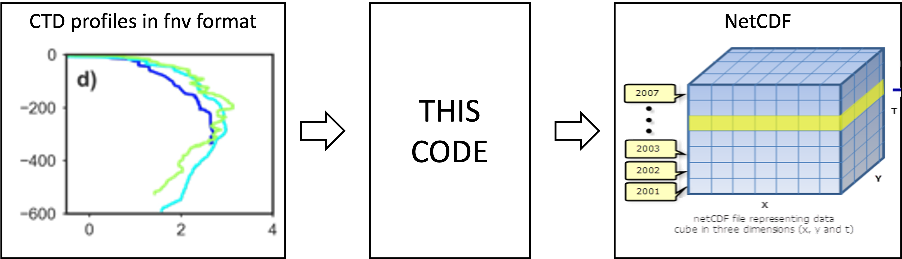

# Project for converting data from ctd and mooring to netcdf

The goal of this project is to convert CTD profiles into seperate and a combined netcdf file that can be published. 




## Dependencies
Made on a MacOs with Python3
1. Fork this repository
2. Use conda or install conda following [these instructions](https://docs.conda.io/projects/miniconda/en/latest/miniconda-install.html) .
3. Install dependencies through requirements.yml in a new virtual environment
```python
conda env create -f requirements.yml
```
4. Activate the new environment
```python
conda activate convert_ctd
```


## Usage

You should be able to use python and know how virtual environments work 
`conda activate deep_water`

1. Put CTD data in `data/raw`
2. Run `ctd_monthly.py`, `CTD_mooring.py`
3. In docs/notebook open notebook and inspect data

## Project Structure

The project structure distinguishes three kinds of folders:
- read-only (RO): not edited by either code or researcher
- human-writeable (HW): edited by the researcher only.
- project-generated (PG): folders generated when running the code; these folders can be deleted or emptied and will be completely reconstituted as the project is run.


```
.
├── .gitignore
├── LICENSE
├── README.md
├── requirements.txt
├── data               <- All project data, ignored by git
│   ├── processed      <- The final, canonical data sets for modeling. (PG)
│   ├── raw            <- The original, immutable data dump. (RO)
│   └── temp           <- Intermediate data that has been transformed, including overview files (PG)
│       └── CTD        <- Intermediate CTD profiles that have been transformed (PG)
│       └── Mooring    <- Intermediate CTD profiles that have been transformed (PG)
│       └── ADCP       <- Intermediate CTD profiles that have been transformed (PG)
├── docs               <- Documentation notebook for users (HW)
│   └── notebooks      <- IPython jupyter notebooks, to view data and get some basic characteristics (HW)
├── img
│   └── figures        <- Figures for the ReadMe or  (PG)
└── src                <- Source code for this project (HW)

```

## Add a citation file
Create a citation file for your repository using [cffinit](https://citation-file-format.github.io/cff-initializer-javascript/#/)

## License

This project is licensed under the terms of the [MIT License](/LICENSE).


## Origin of the project structure (from workshop)
This simple project structure template repository is adapted from the [Good Enough Project](https://github.com/bvreede/good-enough-project) Cookiecutter template by Barbara Vreede (2019).
If you plan to develop a package, check the [template repository for a Python package](https://github.com/UtrechtUniversity/re-python-package).

